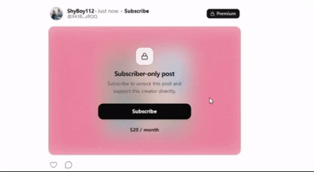
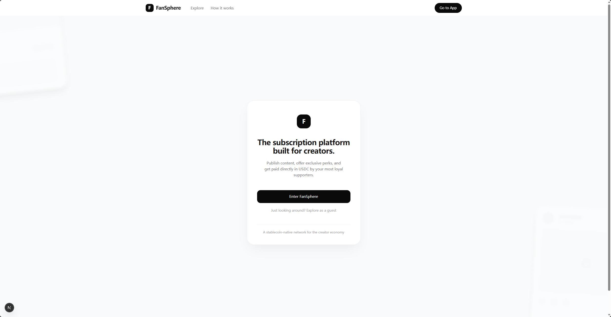
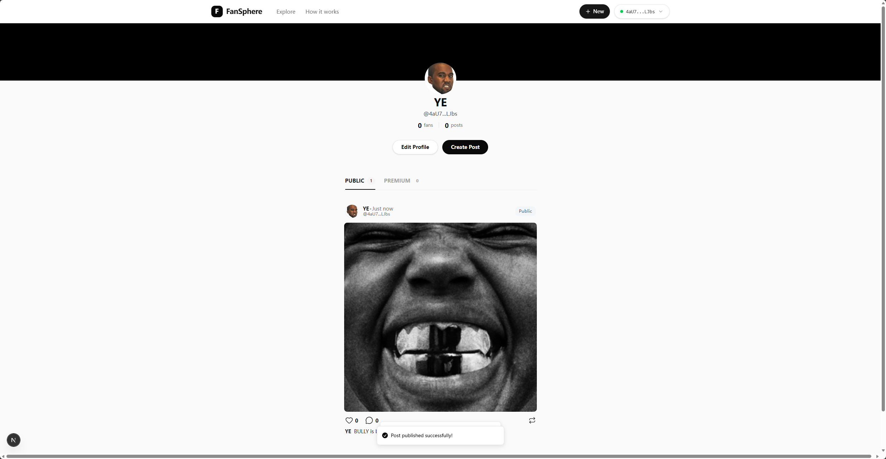
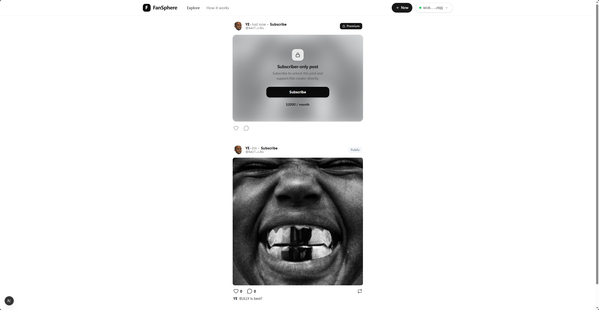
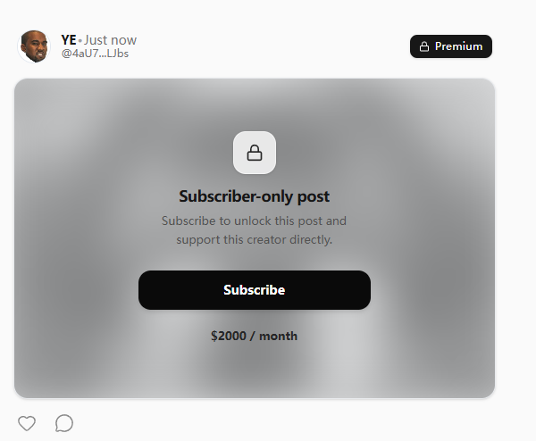

# FanSphere

A Web2.5 creator subscription platform prototype built on Solana, focused on direct wallet-to-wallet payments, on-chain subscription state, and subscription-based content gating.

  

## Overview

FanSphere is a product prototype exploring what a creator subscription platform could look like when the core monetization and access-control logic lives on-chain.

Creators publish content, users subscribe through on-chain payments, and premium content is unlocked based on verifiable subscription state.

This is not a production-ready system. It is a **working early-stage prototype** built to validate the core product loop:

- creator onboarding
- content publishing
- subscription payments
- gated content access
- the connection between on-chain state and frontend rendering

The current version is best described as a **Web2.5 product prototype**: trust-critical logic such as payments, subscriptions, and access control lives on-chain, while heavier features such as indexing, discovery, ranking, and analytics are planned for a future off-chain layer.

## Product Preview

The screenshots below show several core pages and interaction states from the current FanSphere prototype.

### Landing Page

This is the entry page of the product, designed to communicate FanSphere as a creator subscription platform prototype.

  

### Creator Profile

This is the creator profile page, showing creator identity, content sections, and the subscription entry point. It is one of the core pages of the product.

  

### Feed View

This is the current feed view, showing how public and subscription-based content can coexist in the same product experience.

  

### Locked Premium Post

This is the pre-subscription state. Users can see the preview and subscription entry, but the full content remains locked.

  

## Why I Built This

Most creator platforms still rely on platform-controlled payment rails, slow payouts, and database-only access control.

I wanted to explore a lighter Web3-native approach:

- **Put the trust-critical parts on-chain**  
  This includes subscription state, payment outcomes, and access control

- **Keep the heavier product logic off-chain**  
  Media storage, future feed aggregation, search, ranking, and recommendation are better handled outside the program layer

- **Stay close to a usable product experience**  
  The goal is not to build a pure protocol demo, but a product-shaped prototype that feels closer to a real application

For me, FanSphere is also a build-focused project for proving my ability to connect Solana program design, frontend implementation, and product thinking in one end-to-end system.

## Why Solana

Solana is a strong fit for this kind of product because it supports:

- lower interaction costs
- faster transaction confirmation
- a user experience that can handle frequent actions

A creator subscription platform naturally involves repeated interactions such as subscribing, renewing, liking, commenting, and checking access rights. If those interactions are too expensive or too slow, the product experience breaks down quickly. Solana is a practical environment for experimenting with a payment-oriented, high-frequency creator product.

## Current Features

The current prototype already supports:

- **Creator onboarding**  
  Wallet-based creator profile setup with basic configuration

- **Content publishing**  
  Post creation with media uploaded through Irys

- **Subscription flow**  
  Users can subscribe, and subscription state is recorded on-chain

- **Content gating**  
  Private content is unlocked based on subscription status

- **Persistent asset references**  
  Content can still render correctly after refresh because asset references are stored persistently

- **Direct account reads from the frontend**  
  The frontend reads Solana program accounts directly for rendering and state checks

- **Basic social interactions**  
  Includes the on-chain model for comments and likes

## Tech Stack

| Layer | Technology |
|---|---|
| Solana Program | Rust, Pinocchio |
| Frontend | Next.js, React, TypeScript |
| Styling | Tailwind CSS |
| State Management / Data Fetching | React Query, Jotai |
| Wallet Integration | Solana Wallet Adapter |
| Media Storage | Irys |
| On-chain Interaction | `@solana/web3.js` |
| Current Environment | Solana localnet + Irys devnet |

## Architecture Overview

FanSphere currently follows a lightweight Web2.5 architecture:

- **On-chain layer (Solana Program)**  
  Stores core state such as creator profiles, posts, subscriptions, comments, and interaction records

- **Storage layer (Irys)**  
  Stores media assets and content references

- **Frontend layer (Next.js)**  
  In the current version, the frontend reads and writes program accounts directly, handles rendering, subscription checks, and UI state

- **Future off-chain layer (Planned Python Indexer)**  
  Intended for heavier logic such as:
  - feed aggregation
  - search and discovery
  - ranking
  - analytics
  - recommendation

Because the current version still relies on direct account reads from the frontend, it is best understood as a prototype architecture rather than the final production shape.

## On-Chain State Model

FanSphere uses a PDA-based account model to organize on-chain state. This README keeps the explanation high-level and does not go into byte layouts or low-level serialization details.

Core account types include:

- **Creator Profile PDA**  
  Stores creator-level profile data and configuration

- **Post PDA**  
  Stores post state, content references, and visibility metadata

- **Subscription PDA**  
  Represents the relationship between a creator and a subscriber and is used for gated access checks

- **Comment PDA**  
  Stores comment and reply relationships

- **Like Record PDA**  
  Tracks interactions and prevents duplicate actions

The goal of this design is to make the core monetization and access-control logic verifiable through deterministic on-chain state, while leaving heavier product features to a future indexing layer.

## Current Demo Status

FanSphere is currently shared as a **localnet-based prototype**.

At this stage, the repository is mainly intended for:

- code review
- architecture reference
- product showcase
- implementation review

The current version is meant to demonstrate that the core product loop already works, rather than to provide a fully hosted public demo or a polished one-click deployment experience.

Later versions will add:

- devnet deployment
- hosted frontend demo
- cleaner setup guide
- a more complete public demo environment

## PDA Layout

FanSphere uses a small set of deterministic PDAs to model creators, posts, subscriptions, comments, and likes.

- **Creator Profile PDA**  
  Seeds: `["profile", creator_pubkey]`  
  Stores creator-level profile data and configuration.

- **Subscriber Mint PDA**  
  Seeds: `["mint", creator_pubkey]`  
  This is the creator’s membership NFT mint.

- **Post PDA**  
  Seeds: `["post", creator_pubkey, seed_u64_le]`  
  Stores post state, content references, and visibility metadata.

- **Subscription Record PDA**  
  Seeds: `["subscription", creator_pubkey, subscriber_pubkey]`  
  Represents the relationship between a creator and a subscriber.

- **Like PDA**  
  Seeds: `["like", target_pda, user_pubkey]`  
  `target_pda` can be either a post PDA or a comment PDA.

- **Comment PDA**  
  Seeds: `["comment", parent_pda, index_u32_le]`  
  For root comments, `parent_pda = post_pda`.  
  For replies, `parent_pda = parent_comment_pda`.

For a more detailed breakdown of PDA relationships and seed design, see [docs/PDA_LAYOUT.md](docs/PDA_LAYOUT.md).

## Current Limitations

The current version still has several limitations:

- primarily runs on localnet
- no public devnet demo yet
- no mature backend or auth layer
- no indexer
- no full search, recommendation, or feed ranking
- transaction feedback and error handling can be improved further
- automated testing is still limited

## Roadmap

Planned next steps include:

- [ ] deploy to devnet
- [ ] launch a hosted frontend demo
- [ ] introduce a Python indexer
- [ ] improve global feed and discovery
- [ ] add analytics and ranking
- [ ] improve transaction UX and error handling
- [ ] expand testing and engineering quality
- [ ] continue refining the overall product experience

## Open Source Scope

The current repository mainly opens up:

- Solana program code
- core frontend logic
- PDA, parser, and instruction-related implementation
- README and architecture notes

Deployment, ops, and public demo details will be cleaned up and documented more fully in a later version instead of being over-explained in this one.

## What This Project Represents

FanSphere is not just a creator subscription prototype for me.

It is also a build-focused project that demonstrates my ability to:

- design an on-chain account model
- build payment and subscription logic on Solana
- connect program logic, frontend behavior, and product UX
- understand lower-level implementation choices without relying entirely on heavy abstractions
- express both technical judgment and product thinking through a complete project